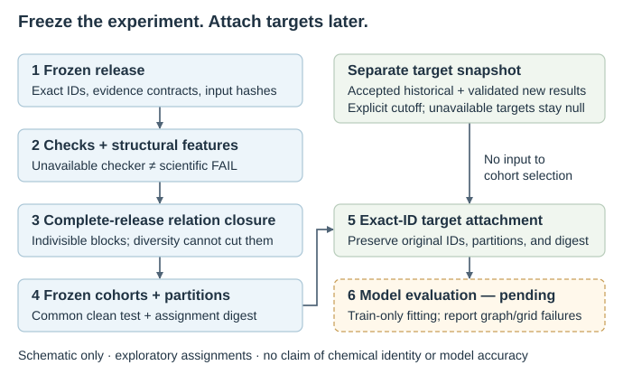

Manuscript and research workflows
=================================

The source checkout includes a journal-neutral software manuscript and a
practical workflow workspace. It covers the whole toolkit: database access,
curation, checks, descriptors, pretrained prediction interfaces, reproducible
dataset preparation, and later target attachment. It can also supply methods
text for the main CoRE-MOF database paper.

These are development-version documents, not an announcement of a stable
release, an official assignment manifest, or completed predictive benchmarks.
The source baseline, data cutoff, evidence provenance, and remaining author
decisions are explicit. Current benchmark assignments have
``official_split=false``.

.. note::

   This developer-manuscript workspace retains its dated, target-independent
   workflow and verification record. For the current target-complete CR/NCR
   workflow, use :doc:`target_first_benchmark`: fix required endpoint definitions
   and finite-target eligibility before building cohorts, while retaining
   whole-release grouping and label-purity checks. Target magnitudes are not
   used for grouping or diversity selection. The archived verification record
   is not a validation of later package changes.

Download the editable sources
-----------------------------

* :download:`Workspace index <../../manuscript/README.md>`
* :download:`Manuscript draft <../../manuscript/manuscript.md>`
* :download:`Reproducible workflow recipes <../../manuscript/workflows.md>`
* :download:`Implementation and evidence map <../../manuscript/evidence.md>`
* :download:`Figure and table plan <../../manuscript/figures_and_tables.md>`
* :download:`Primary references and citation tasks <../../manuscript/references.md>`
* :download:`BibTeX references <../../manuscript/references.bib>`
* :download:`Editable workflow diagram <../../manuscript/figures/workflow.svg>`
* :download:`Workflow diagram as PDF <../../manuscript/figures/workflow.pdf>`
* :download:`Workflow diagram as 320-dpi PNG <../../manuscript/figures/workflow.png>`
* :download:`Verification scope and results <../../manuscript/verification.json>`

Use the workspace in the source repository when following relative links
between Markdown documents. Downloaded individual files do not automatically
include their linked companions.

The schematic shows the legacy target-independent design boundary. Its connected
structural blocks are partition guards, not proof of chemical identity; missing
evidence adds no match, and target availability never enters cohort selection.
The complete criterion definitions and API examples are in the downloaded
workflow guide and :doc:`splitting`.

Verification and further work
-----------------------------

The manuscript workflow regression compiles the Python recipes, executes a
small synthetic non-representative-diversity example, verifies frozen target
attachment, parses the CLI examples, checks local links, and checks the
diagram's editable text and minimum font size. It does not replace numerical,
full-release, model-input, or scientific-backend verification. The downloadable
verification record lists what was actually run.

The figure plan preserves separate panel files, compact dimensions, readable
typography, explicit missingness, and separate accessible-only/full-textural
feature spaces. Model preprocessing coverage and predictive performance remain
pending. Restricted structure-resolved target data are not distributed with
these documents.

See also :doc:`features`, :doc:`installation`, and :doc:`references`.
